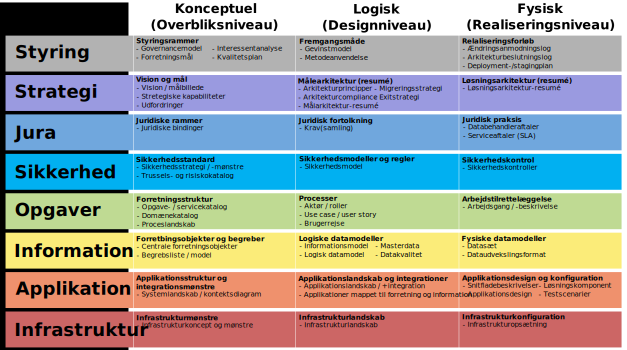

# Vejledning om arkitekturmetode

## Indledning

Arkitektur er en central del af digitalisering. Det gælder både på det brede virksomhedsperspektiv, hvor det gælder om at skabe god og tværgående it-understøttelse af den samlede forretning/forvaltning, og når man ser på det enkelte projekt, hvor det gælder om at skabe en optimal løsning indenfor det konkrete scope.

Arkitekturarbejdet har således både til formål at sikre et fornuftigt design af en given løsning, samtidig med at det skal sikre sammenhæng til andre relevante løsninger. Dokumentation skal understøtte dialog mellem forretning og it, mellem kunde og leverandør, samt mellem projektets interessenter – og dermed også koordinering på tværs af projekter og løsninger. Desuden skal en del af dokumentationen understøtte den efterfølgende drift, vedligeholdelse og videreudvikling af løsningen.

En væsentlig faktor for succes med arkitekturarbejdet er en klar og indarbejdet metode, som integrerer med de øvrige discipliner i organisationen (projektstyring, drift, it-styring etc.). Det er dog ikke kun metoden, som er vigtig. De overordnede rammer, så som mandat fra ledelsen, de nødvendige ressourcer og styringsrammer, er også centrale forudsætninger, for at arbejdet med arkitektur bliver værdiskabende. Dette gælder naturligvis ikke i mindre grad, når der er tale om samarbejde på tværs af organisationer.

Formålet med denne vejledning er at støtte digitaliseringsprojekter i at anvende den fællesoffentlige digitale arkitektur (FDA) med udgangspunkt i en procesorienteret arkitekturmetode, som kan supplere FDA [Retningslinjer om arkitekturdokumentation](https://arkitektur.digst.dk/node/563). Det skal understreges, at denne vejledning alene er udtryk for anbefalinger af god praksis og ikke et formelt krav om at anvende en bestemt arkitekturmetode.

Det er op til den enkelte myndighed og det enkelte projekt at vælge og tilpasse den rette metode.

Vejledningen tager udgangspunkt i standarden _The Open Group Architecture Framework_ (TOGAF) og standardens _Architecture Development Method (ADM)._ Denne standard er valgt, fordi den er åben, moden, udbredt og understøttes af kursus- og certificeringstilbud i Danmark og udlandet. Den er desuden understøttet af model­sproget ArchiMate, der ligesom TOGAF anvendes i det fælleseuropæiske arkitekturarbejde.

Vejledningen sætter anvendelsen af TOGAF i kontekst af den fællesoffentlige rammearkitektur (referencearkitekturer, byggeblokke, modelregler mv.), model for arkitekturreview og projektmodel.

Vejledningen skal hjælpe læseren med at forstå, hvordan TOGAF kan bruges som arkitekturmetode til at udarbejde en række af de prioriterede og udvalgte arkitekturprodukter i FDA-arkitekturreolen. Herunder vil vejledningen også komme med eksempler på brugen af TOGAF-arkitekturmetoden i relation til projektstyring.

Fokus for vejledningen er at give anbefalinger i forhold til konkrete aktiviteter og arkitekturprodukter i relation til FDA. Vejledningen er ikke en udtømmende forklaring af brugen af TOGAF. Af hensyn til forståelse har vi forsøgt at tilpasse visse dele af TOGAF til en dansk offentlig kontekst. For en fuld forståelse af TOGAF henvises til fremstilling på Open Groups hjemmeside.

Arkitekturarbejde sker ofte i projektregi, og vejledningen fokuserer derfor primært på arkitekturaktiviteter og produkter i projektregi. Arkitekturmetoden, og dermed denne vejledning, kan dog også anvendes i en bredere kontekst, som fx EA-initiativer, program- og porteføljestyring eller i den daglige drift af it. Projekter i regi af den Fællesoffentlige Digitaliseringsstrategi (FODS) vil være typiske brugere af denne vejledning, men vejledningen er udformet således, at andre projekter også vil finde den anvendelig.

TOGAF som grundlæggende arkitekturmetode kan ses som afløser for OIO-arkitekturmetode, som indtil overgangen til FDA har været de facto fællesoffentlig standard for arkitekturarbejde i Danmark. Da OIO indholdsmæssigt har været baseret på TOGAF, er det forventningen at dette skift vil være relativt let. Skiftet er begrundet i et ønske om at anvende et åbent og internationalt anerkendt standardrammeværk som fælles referenceramme, samtidig med at der ikke er tale om krav om eksklusiv anvendelse af ét specifikt rammeværk.

Denne vejledning er derfor ikke en specificering af en ny FDA-metode, men en vejledning i brugen af TOGAF-arkitekturmetoden (ADM) set i en FDA-kontekst.

### Målgruppe

Målgruppen for vejledningen er personer, der på forhånd har kendskab til TOGAF eller tilsvarende arkitekturmetode på et niveau, svarende til en \_Foundation-\_certificering. Den primære målgruppe er personer, som udarbejder og anvender arkitekturdokumentation (fx it-arkitekter). Desuden kan vejledningen med fordel læses af personer, som har ansvar for projektets proces og produkter (projektledere), samt personer som blot skal forstå arkitekturmetoden og de arkitekturprodukter, der skal anvendes i projektet. Sidstnævnte gruppe kan fx være kundens projektdeltagere og leverandørens projektleder og udviklere.

### Læsevejledning

Vejledningen udspringer af Hvidbogens arkitekturregler 1.3 om anvendelse af fælles ramme for beskrivelse af arkitektur, og herunder mere specifikt _Retningslinjer for formidling og dokumentation af arkitektur i digitaliseringsprojekter_ (i det følgende benævnt [_Retningslinjer om arkitekturdokumentation_](https://arkitektur.digst.dk/node/563)), på lige fod med en række andre vejledninger og regler for begrebs- og datamodellering (se Figur 1).

Figur 0: Sammenhæng mellem tre af hvidbogens arkitekturregler til side- og underordnede dokumenter

Vejledningen kan læses helt eller delvist, alt efter behov. Specielt det først kapitel, der sætter TOGAF metoden i sammenhæng med projektmetode og Fællesoffentlig Digitalt Arkitektur, bør læses af alle. Resten af vejledningen er tænkt som et opslagsværk. Væsentligheden af de enkelte afsnit afhænger af den enkelte læser og det aktuelle projekt.

**Kapitlet** **_Kom godt i gang med FDA og TOGAF_** indeholder tre afsnit, som alle skal hjælpe læseren med at komme i gang med at forstå og anvende dele af TOGAF i digitaliseringsprojekter.

-   **Afsnittet** **_Om TOGAF_** giver en kort introduktion til de mest centrale elementer i TOGAF. Læseren vil få en hurtig overflyvning, hvor der for en dybere forståelse henvises til TOGAF-specifikationen.
-   **Afsnittet** **_Sammenhæng mellem FDA-arkitekturreolen og TOGAF_** beskriver de grundlæggende sammenhænge mellem FDA og TOGAF, med hensyn til de udvalgte arkitekturprodukter. Læseren vil få en kort forklaring af, hvordan de udvalgte FDA-arkitekturprodukter skal ses i sammenhængen med TOGAF.
-   **Afsnittet** **_Sammenhæng mellem projektstyring og TOGAF_** beskriver sammenhængen mellem styringen af et digitaliseringsprojekt og det relaterede arkitekturarbejde ved anvendelsen af TOGAF. Læseren vil få en kort forklaring på, hvordan man får arkitekturarbejdet efter TOGAF ADM til at passe ind i sin projektmodel.

**Kapitlet** **_Vejledende brug af TOGAF ADM i digitaliseringsprojekter_** giver den erfarne arkitekt en forståelse for, hvilke særlige forhold, som man skal være opmærksom på ved brugen af TOGAF i arkitekturprojekter i en dansk offentlig kontekst. Kapitlets primære afsnit (**_Faser og aktiviteter_\*\***)** gennemgår alle faserne i TOGAF ADM samt giver anbefaling til, hvornår de enkelte udvalgte FDA-arkitekturprodukter skal udarbejdes. Endelig samler afsnittet **_Liste over arkitekturprodukter_\*\* et overblik over relationen mellem de enkelte faser og arkitekturprodukter.

## Kom godt i gang med FDA og TOGAF

Dette kapitel giver en kort introduktion til nogle af de mest centrale elementer i TOGAF og sætter dem i relation til FDA.

### Om TOGAF

The Open Group Architecture Framework (TOGAF) er en åben standard under [The Open Group](http://www.opengroup.org/), som er en gennemprøvet Enterprise Arkitekturmetode og -ramme. Standarden er internationalt udbredt og anvendes af nogle af verdens førende organisationer. Med tiden har standarden også fået en stor udbredelse i Danmark, hvor mange både private og offentlige organisationer anvender TOGAF eller dele heraf.

Det anbefales, at TOGAF tilpasses den enkelte organisations behov og modenhed, samt at standarden integreres med øvrige standarder og metoder, som organisationen gør brug af. Der er således udarbejdet en række hvidbøger og vejledninger i The Open Group regi, som beskriver, hvordan man integrerer og bruger TOGAF med andre rammeværk og metoder. Ligeledes findes der i dag en række værktøjer og teknikker, som understøtter brugen af TOGAF.

Du kan læse om TOGAF og rammeværkets generelle anvendelse i arkitekturarbejde her: [http://www.opengroup.org/togaf](http://www.opengroup.org/togaf)

TOGAF-standarden består af fem hovedelementer:

-   Arkitekturmetode (ADM)
-   Vejledning og teknikker i forhold til anvendelsen af arkitekturmetoden
-   Arkitektur indholdsrammeværk
-   Kontinuum og værktøjer, inklusive referencemodeller
-   Rammeværk for arkitekturkapabiliteter

#### Architecture Development Methods (ADM)

En hel central del af TOGAF er Architecture Development Methods (ADM), som er en arkitekturudviklingsmetode med en trinvis og iterativ tilgang til at udvikle og styre arkitekturarbejdet (Se Figur 1). Det skal understreges, at TOGAF både kan anvendes sammen med projekt- og udviklingsmetoder, der er agile og vandfaldsorienterede – det er altid op til en lokal tilpasning af metodeanvendelsen.

.svg>)

Figur 1 TOGAF Architecture Development Method (ADM)

Metoden består af en opstartsfase (Preliminary), og otte faser, som alle er tæt forbundet til en kravstyringskerne (Requirements Management). Hver fase består af en række aktiviteter, ligesom der defineres en række input og output i forhold til hver fase. Fase C, Information Systems Architecture, opdeles desuden i to underfaser, hhv. Data og Application.

Selvom metoden kan læses som en stringent fremgangsmåde, skal de enkelte faser og deres aktiviteter ses som temaer, som bør overvejes i et hvert digitaliseringsprojekt. De enkelte fokusområder og aktiviteter skal derfor kobles til de generelle projektaktiviteter, som kræves af den anvendte projektmetode.

#### ADM-vejledninger og teknikker

TOGAF indeholder desuden en række vejledninger og teknikker i forhold til anvendelsen af arkitekturmetoden (ADM). Her kan blandt andet hentes hjælp til tre væsentlige koncepter for håndtering af kompleksitet i udviklingen og styringen af arkitektur. Den ene er forståelsen af, hvilken rækkefølge faserne bør gennemløbes (iterationer). Den anden er forståelsen af, at metoden kan anvendes på flere forskellige dele af den samlede arkitektur (niveauer). Den tredje er forståelsen for at en arkitektur kan spænde fra at være generisk og generelt anvendelig, til at en arkitektur kan være meget specifik for et helt konkret område (kontinuum).

##### Iterationer

TOGAF definerer, ud over den sekventielle tilgang (fra fase A til H) en række iterationer. Hver iteration har et særligt formål i arkitekturarbejdet, men metoden kan som nævnt tilpasses den enkelte organisations behov og krav. Figur 2 illustrerer de anbefalede TOGAF ADM-iterationer.

Figur 2 Anbefalede TOGAF ADM-iterationer

Iterationerne er væsentlige at definere i forhold til integrationen til organisationens projektmodel, uanset om organisationens projektstyring er baseret på vandfald eller agil projektstyring. Tilgangen til projekter uddybes i kapitlet _Sammenhæng mellem projektstyring og TOGAF_.

##### Niveauer

Arkitekturmetoden kan anvendes på alle typer digitaliseringsprojekter. De berørte arkitekturer vil have forskellige formål og have en forskellige spændvidde og dybde. Nogle arkitekturer vil dække en silo-løsning, der omfatter et enkelt system på et afgrænset forretningsdomæne, andre et økosystem, hvor mange løsninger skal kunne arbejde sammen på tværs af domæner. Nogle arkitekturer vil tage højde for meget specifikke behov; andre vil være mere generelle. Nogle vil adressere detaljer; nogle vil repræsentere et større holistisk billede.

Som arkitekt eller projektleder skal man derfor gøre det klart, på hvilket niveau man arbejder med arkitektur i det konkrete projekt, så arkitekturdokumentationen udarbejdes i en tilstrækkelig grad – ikke for meget; ikke for lidt.

##### Kontinuum

Et tredje koncept, som TOGAF anvender til at håndtere kompleksiteten i arkitekturarbejdet er kontinuum. Arkitekturkontinuummet beskriver, hvorledes arkitekturelementer (arkitekturbyggeblokke) kan indplaceres imellem to yderpunkter. Som Figur 3 illustrerer, er det ene yderpunkt generiske arkitekturer, og det andet er organisations-/ projekt­specifikke arkitekturer. Mellem disse yderpunkter ligger fx standarder for et forretningsdomæne, fx sundhedsdomænet. Jo mere generisk en byggeblok er, des større er sandsynligheden for genbrug uden for organisationen/projektet. I en fællesoffentlig kontekst er fokus typisk på interoperabilitet, i en koncernkontekst på konsolidering. I begge tilfælde er det centralt at forholde sig til, hvad der er det rette niveau for standarder på tværs af løsninger. Standardisering handler så at sige om, hvor i dette kontinuum, det er nødvendigt og tilstrækkeligt at anvende samme specifikation på et element i arkitekturen – fx vedrørende udvekslingsformat, protokoller, applikationskomponenter eller teknologisk platform. Når arkitekturen understøttes af konkrete løsningsbyggeblokke, taler TOGAF om et løsningskontinuum, som parallel til arkitekturkontinuum.

Figur 3 TOGAF Kontinuum

#### Indhold og arkitekturprodukter

Figur 4 viser _TOGAF Content Metamodel_ for arkitekturarbejdets indhold relateret til ADM. Metamodellen er i TOGAF-specifikationen yderligere detaljeret med blandt andet logiske sammenhænge mellem de forskellige indholdselementer.

Figur 4 TOGAF Content Metamodel

Et indholdselement kan betragtes som en byggeblok, fx en proces, et applikationskomponent, et netværkskomponent.

TOGAF giver desuden anbefalinger til, hvilke arkitekturprodukter (kaldet artefakter) i relation til _Content Metamodel_, der bør udarbejdes i de forskellige faser af ADM (se Figur 5). TOGAF opdeler arkitekturprodukterne i tre typer:

-   Katalog (lister)
-   Matrix (matricer)
-   Diagram (illustrationer)

Et katalog er en liste over indholdselementer af en bestemt type eller relaterede typer. Det kan for eksempel være en liste over aktuelle roller i projektet eller komponenter i applikationsporteføljen, som er relevant at få dokumenteret.

En matrix er et skema, der viser sammenhæng mellem elementer. Det kan fx være en RACI-matrix, som beskriver hvilket ansvar en række roller har i et projekt.

Et diagram er en illustration af information (typisk todimensionelt geometrisk symbolsk repræsentation), i henhold til en visualiseringsteknik (fx BPMN, UML, ArchiMate). Det kan fx være et organisationsdiagram eller et procesdiagram. Diagrammer kan dokumenteres på mange måder, og der findes specifikke standarder inden for forskellige områder. Fx anvendes ofte BPMN til modellering af forretningsprocesser, UML til modellering af applikationer/data og ArchiMate til overordnet illustration af arkitektursammenhænge (se desuden [FDA-vejledning for anvendelse af ArchiMate](https://arkitektur.digst.dk/node/634)).

Figur 5 TOGAF-artefakter relateret til ADM (se bilag A)

Som udgangspunkt vil det være nemmest at udarbejde kataloger, hvorfor det vil være et godt udgangspunkt for ny arkitekturdokumentation. Som vist i Figur 6, kunne det fx være et katalog over de aktuelle processer, som projektet kommer til at berøre og et katalog over de it-systemer, som indgår i scopet for projektet. Næste skridt kan herefter være at lave en matrix, der viser sammenhængen mellem de listede processer og it-systemer, for at anskueliggøre hvilke it-systemer, som understøtter hvilke processer. Endelig kan der laves en mere detaljeret visning i et diagram, som viser de mere konkrete sammenhænge mellem processerne og it-systemerne, for at vise om en proces henter eller sender data til it-systemet. Der kan ligeledes med diagrammet let laves relationer til andre elementer i arkitekturen (fx roller, funktioner, services, mål, principper og infrastrukturelementer).

Figur 6 Sammenhæng mellem katalog, matrix og diagram (map)

De forskellige artefakter kan enten stå alene eller samles i et arkitekturleverancedokument. Leverancedokumenterne kan indgå som en del af projektets ledelsesdokumentation, for at underbygge projektets styring, vision, målbillede, planner etc. TOGAF definerer en række arkitekturleverancedokumenter. Dette emne uddybes yderligere i afsnittet _Sammenfald mellem styringsmetoder_ i kapitlet _Sammenhæng mellem projektstyring og TOGAF_.

### Sammenhæng mellem FDA-arkitekturreolen og TOGAF

Dette afsnit beskriver de grundlæggende sammenhænge mellem FDA og TOGAF med hensyn til udvalgte arkitekturprodukter.

FDA [Retningslinjer om arkitekturdokumentation](https://arkitektur.digst.dk/node/563) beskriver en række udvalgte arkitekturprodukter (se Figur 7). Disse tager udgangspunkt i TOGAF-arkitekturprodukterne, men er samtidig baseret på _best practice_ erfaringer fra danske myndigheder og deres leverandører.

Der er en klar sammenhæng mellem de fleste TOGAF anbefalede arkitekturprodukterne og FDA-arkitekturprodukterne. Som illustreret i Figur 8 er der i særdeleshed en meget tæt kobling mellem TOGAF-faserne Business, Data, Application, Technology og FDA-grundperspektiverne Opgaver, Information, Applikation, Infrastruktur. FDA-arkitekturprodukterne er desuden beskrevet nærmere i FDA [Retningslinjer om arkitekturdokumentation](https://arkitektur.digst.dk/node/563).

Figur 8 Sammenhæng mellem TOGAF-artefakter og FDA -arkitekturprodukter

TOGAF kategoriserer, som nævnt i forrige kapitel, de enkelte arkitekturprodukter efter ADM-faserne på baggrund af, hvilken fase produktet primært bliver udarbejdet. På samme vis kan FDA-arkitekturreolens udvalgte produkter kategoriseres efter TOGAF ADM-faserne – se Tabel 2 på side 41. Der er således en sammenhæng mellem FDA-arkitekturreolens udvalgte produkter og de forskellige faser i TOGAF ADM. Figur 9 illustrerer sammenhængen mellem FDA-arkitekturreolens produkter og TOGAF ADM.

Figur 9 Sammenhæng mellem FDA-arkitekturreolens produkter og TOGAF ADM

### Sammenhæng mellem projektstyring og TOGAF

Dette afsnit beskriver, hvordan arkitekturarbejdet efter TOGAF ADM kan passes sammen med projektstyring af digitaliseringsprojekter.

TOGAF ADM dækker ind over en række domæner, som illustreret i Figur 10. Så selvom TOGAF ADM hverken er en ren metode til projektstyring, løsningsudvikling eller drift, så har TOGAF ADM-elementer af det hele.

Figur 10 Styringsmetoder som arkitekturmetoden er en delmængde af

Figuren viser, at arkitekturarbejdet indgår i både projektstyringen, løsningsudviklingen og den efterfølgende driftssituation. TOGAF ADM har således et bredere scope end projektstyringen. Hvor projektstyringen stopper efter sidste leverance i projektet, fortsætter arkitekturarbejdet også i forhold til fremtidige ændringer til leverancerne. Omvendt kan TOGAF ADM som sådan ikke stå alene, da der ikke i TOGAF er defineret særlige mekanismer til styring af projekter, ligesom der heller ikke findes særskilte mekanismer til løsningsudvikling eller drift. Tilsvarende er fx porteføljestyring og programstyring discipliner, der supplerer TOGAF i forhold til det bredere enterprise-perspektiv.

#### Projektmodeller

Der tages i afsnittet udgangspunkt i projektmodellen PRINCE2, som de fleste offentlige it-projektmodeller er afarter af – herunder [Statens it-projektmodel](https://arkitektur.digst.dk/node/1057) og flertallet af de kommunale projektmodeller. TOGAF bør dog også kunne tilpasses andre typer projektmodeller. Sammenstillingen af PRINCE2 og TOGAF ADM kan diskuteres, men denne vejledning kommer med et bud, som bør tilpasses til den konkrete projektudførsel. Se også Open Groups [whitepaper om brug af TOGAF ADM sammen med gængse projektstyringsmetoder](https://publications.opengroup.org/white-papers/togaf/w16b).

I FDA [Retningslinjer om arkitekturdokumentation](https://arkitektur.digst.dk/node/563) (afsnittet _Arkitekturprodukter i projektfaser_) beskrives i oversigtform de vigtigste arkitekturprodukter i forhold til hovedfaserne i den statslige it-projektmodel. Som nævnt i denne sammenhæng, bør den konkrete opdeling altid planlægges i kontekst af det enkelte projekt og sættes i forhold til den valgte udviklingsmetode.

PRINCE2 er en faseopdelt model, som er illustreret i Figur 11.

Figur 11 PRINCE2-projektmodellens faser

Efter at have fastlagt forventninger, mål og rammer for projektet, er projektets primære opgave at udvikle en eller flere leverancer. Efter den sidste leveringsfase, afsluttes projektet. Gevinstrealiseringen sker efter levering af de kravstillede leverancer, hvilket fremgår tydeligere i Statens it-projektmodel, illustreret i Figur 12.

Figur 12 Statens it-projektmodel

Der kan laves en overordnet sammenstilling af Statens it-projektmodel og TOGAF ADM, som illustreret i Figur 13. Som nævnt i afsnittet _Architecture Development Methods (ADM)\_\_,_ bør de enkelte ADM-faser og deres aktiviteter ses som temaer, som bør overvejes i et hvert digitaliseringsprojekt. De enkelte fokusområder og aktiviteter skal derfor kobles til de generelle projektaktiviteter, som kræves af den anvendte projektmetode.

Figur 13 Overordnet sammenstilling af Statens it-projektmodel og TOGAF ADM

Eftersom der ikke kan laves en 1-til-1 sammenstilling mellem faserne i henholdsvis Statens it-projektmodel og TOGAF ADM, skal projektet vurdere vægtningen af de enkelte TOGAF ADM-faser inden for projektmodellens faser. Tabel 1 giver et eksempel på, hvordan vægtningen af TOGAF ADM-faserne kan mappes ind i Statens it-projektmodel. Kolonnerne viser de fire faser i den generiske projektmodel, hvor disse samtidig er mappet til de fire grundlæggende iterationer af TOGAF ADM. Bemærk at fasen C Informations Systems Architecture her er delt op i C1 Dataarkitektur og C2 Applikationsarkitektur. Desuden er Kravstyring ikke vist i tabellen, men indgår i hele processen på tværs af såvel projekt som TOGAF ADM-faserne.

Tabel 1: Eksempel på sammenhæng mellem Statens it-projektmodel og TOGAF ADM (se bilag A)

I projektets analysefase vil fokus være på at udarbejde den nødvendige baseline-arkitektur og den fremadrettede målarkitektur. Der vil dog også blive set på mulige løsninger (løsningsarkitektur) og migreringsplaner, for at vurdere hvorvidt løsninger og planer er realiserbare. Når projektet går ind i gennemførelsesfasen, vil fokus rykke sig over på løsningsarkitektur og planlægning, og i løbet af fasen også styring af implementeringsaktiviteterne.

#### Agil tilgang til ADM

Som nævnt tidligere i Figur 2 _Anbefalede TOGAF ADM-iterationer_, sker arbejdet i TOGAF ADM ofte i iterationer, hvor TOGAF specificerer en række anbefalede iterationer. Det betyder, at arbejdet med TOGAF ADM også understøtter agile udviklingsmetoder, som ofte anvendes i større systemudviklingsprojekter.

En agil tilgang til ADM kan betyde at der inden for de enkelte projektiterationer (flere sprints) arbejdes med hele ADM-cyklussen. Derved afsluttes hver projektiteration med en delløsning (faserne i B-G), som efterfølgende underlægges arkitekturændringsstyring (fase H). Der kan inden for hver projektiteration være større eller mindre fokus på specifikke arkitekturdomæner (forretning, data, applikation og teknologi). En projektiteration kan fx have fokus på udvikling af en teknisk komponent, hvorved at det primært vil være fase D, som prioriteres.

#### Sammenfald mellem styringsmetoder

Som nævnt tidligere*,* er der et overlap mellem TOGAF og andre styringsmetoder. Overlappet betyder, at der er aktiviteter, leverancer og andre begreber, som er sammenfaldende mellem de relaterede styringsmekanismer. Fx nedbrydes et projekt oftest i arbejdspakker, som indeholder oplysninger om en eller flere påkrævede produkter, som en teamleder eller et teammedlem får ansvaret for at udføre. I TOGAF defineres ligeledes arbejdspakker (_Work Package_).

Som nævnt i afsnittet _Indhold og arkitekturprodukter\_\_,_ definerer TOGAF også en række arkitekturleverancedokumenter, som bliver udarbejdet og vedligeholdt gennem ADM-faserne. Der er et vist sammenfald mellem TOGAF-dokumenterne og den øvrige dokumentation, som udarbejdes og vedligeholdes i et projekt (fx projektgrundlag, projektplan, business case mv.).

Det er væsentligt at bemærke, at arbejdet med arkitektur i digitaliseringsprojekter ikke skal føre til dobbeltarbejde. Det er derfor vigtigt at aktiviteter og dokumentation i forbindelse med ADM-faserne komplementere de generelle aktiviteter og dokumentation i projektet.

Som eksempler på TOGAF-arkitekturleverancedokumenter kan nævnes:

-   **_Request for Architecture Work\_\_:_** Indeholder en anmodning fra sponsororganisationen til arkitekturorganisationen om opstart af arkitekturarbejdet. Dokumentet kan sidestilles med PRINCE2-dokumentet _Project Brief_.
-   **_Architecture Definition Document\_\_:_** Indeholder et samlet billede af de centrale artefakter, der er udarbejdet i løbet af projektet. Dokumentet dækker alle arkitekturdomænerne _Business_, _Data_, _Application_ og _Technology_, svarende til FDA-grundperspektiverne Opgaver, _Information,_ _Applikation_ og _Infrastruktur_, og dækker tidsspændet fra baseline-arkitektur til målarkitektur, inkl. eventuelle mellemliggende transitionsarkitekture. Dokumentet kan til en vis grad sidestilles med PRINCE2-dokumentet _Project Product Description_.
-   **_Statement of Architecture Work:_** Definerer omfanget og tilgangen, som vil blive brugt til at gennemføre projektet. Dokumentet beskriver projektet og dets omfang, arkitekturvisionen, roller/ansvar, leverancer, projektplan mv. Dokumentet kan sidestilles med PRINCE2-dokumentet _Project Initiating Document (PID)_.

En liste over alle TOGAF-arkitekturleverancedokumenter, samt hvilke ADM-faser de er henholdsvis input og/eller output, kan findes i TOGAF-specifikationen ([http://pubs.opengroup.org/architecture/togaf9-doc/arch/chap32.html](http://pubs.opengroup.org/architecture/togaf9-doc/arch/chap32.html)).

#### Projektmodel for arkitekturprojekter

Et arkitekturprojekt er ikke et begreb defineret i TOGAF-standarden. Det bruges dog ofte om et projekt, der udføres for at definere og beskrive en arkitektur, der efterfølgende skal implementeres. Dermed gennemføres TOGAF ADM-faserne A til F, svarende til den anbefalede TOGAF-iteration _Architecture Development Iteration_ (se Figur 2 _Anbefalede TOGAF ADM-iterationer_). Arkitekturprojektet vil være efterfulgt af et implementeringsprojekt, som realiserer den specificerede løsning.

For en mere udførlige beskrivelse af anvendelsen af projektmetoder til gennemførelse af denne iteration, henvises til Open Group hvidbogen [_Architecture Project Management – How to Manage an Architecture Project using the TOGAF® Framework and Mainstream Project Management Methods_](https://publications.opengroup.org/w16b).

## Vejledende brug af TOGAF ADM i digitaliseringsprojekter

Med udgangspunkt i TOGAF ADM, beskriver dette kapitel hvornår der arbejdes med hvilke FDA-arkitekturprodukter. Desuden giver kapitlet eksempler på, hvor man skal forholde sig til de forskellige elementer i FDA, som fx referencearkitekturer, modelregler, integrationsmønstre, tekniske protokoller og andre standarder, fællesoffentlige it-services mv.

Det skal bemærkes, at selvom TOGAF forholder sig til arkitektur i en større kontekst, fokuserer dette kapitel primært på arkitektur, som håndteres inden for konkrete løsningsprojekter. Der kan derfor være beskrivelser i nærværende kapitel, som supplerer de generelle TOGAF-anbefalinger.

### Faser og aktiviteter

Dette afsnit beskriver FDA-anbefalinger til aktiviteterne i de forskellige faser af TOGAF ADM.  Beskrivelsen af aktiviteterne er et tillæg til TOGAF-specifikationen, hvor der i detaljer er beskrevet det anbefalede input og output i forhold til de enkelte faser ([http://pubs.opengroup.org/architecture/togaf92-doc/arch/chap04.html](http://pubs.opengroup.org/architecture/togaf92-doc/arch/chap04.html)).

Hver fase er beskrevet efter følgende skabelon:

-   Fasenavn
-   Kort beskrivelse af formål med fasen
-   Oversigt over aktiviteter i fasen
-   Gennemgang af de væsentligste aktiviteter i forhold til FDA
-   Udvalgte FDA-arkitekturprodukter ved afslutning af fasen

Udvalgte arkitekturprodukter er i det følgende angivet således: **Arkitekturprodukt**

#### Præliminære fase

Præliminære fase

Formålet med den præliminære fase er at forberede og igangsætte de nødvendige aktiviteter, for at arkitekturarbejdet kan blive en del af organisationens digitaliseringsprojekter. Med andre ord skal fasens aktiviteter være medhjælpende til at definere og etablere den ønskede arkitekturkapabilitet. Det indbefatter blandt andet en definition af arkitekturrammen og vejledende principper for arkitekturarbejdet, herunder tilpasning af arkitekturmetode og valg af værktøjer.

Ifølge TOGAF gennemføres den præliminære fase ideelt set kun én gang for alle fremtidige projekter. Hvert projekt starter således i fase A. I praksis sker det både iterativt og i mange forskellige, overlappende domænekontekster. Fx fællesoffentligt domæne (FODS/FDA), fælleskommunalt, i sundhedsdomænet, i skatteministeriet osv. jf. [hvidbogens](https://arkitektur.digst.dk/mandat-og-styring/hvidbog-om-faellesoffentlig-digital-arkitektur) arkitekturprincip _Arkitektur styres på rette niveau efter fælles rammer_.

-   Et projekt bør altid starte med at afklare sin kontekst og metode i initieringsfasen
-   I tværoffentlige projekter er der tale om tilpasning til en tværorganisatorisk kontekst

### Aktiviteter i fasen:

1. Rammesætte berørte organisatoriske enheder (snitflader til andre enheder/projekter)
2. Validere styrings- og støtterammeværk (projektmodel, governancemodel etc.)
3. Definere og etabler arkitekturorganisation/-team (roller, ansvar, processer etc.)
4. Identificere og forholde sig til arkitekturprincipper
5. Skræddersy arkitekturmetoden ud fra TOGAF og eventuelt andre arkitekturrammer
6. Udvikle strategi og implementeringsplan for værktøjer og teknikker

Først og fremmest bør de relevante interessenter og deres interesser i forhold til arkitekturarbejdet identificeres. Særligt bør der ses efter organisatoriske enheder (både internt og eksternt for egen organisation), som vil blive påvirket eller vil opnå gevinster i forhold til løsningen. Arbejdet af denne aktivitet vil resultere i en **interessentanalyse**.

Et væsentligt resultat af denne fase er projektets **governancemodel**, som beskriver de overordnede organisatoriske rammer for at udøve governance (strategi, set-up med centrale aktører/fora ift. ansvar og beslutningsprocesser). Fx skal der, i projektets styregruppe og ledelse, forankres et klart ansvar for projekters arkitekturleverancer. Desuden skal de relevante styringsmekanismer hos de relevante interessenter identificeres, så der bliver en fornuftig tværgående governance. Fx et samspil på tværs af et ministeriums interne arkitekturboard, den fællesoffentlige styregruppe for data og arkitektur (SDA) og det fælleskommunale it-arkitekturråd. Ved ændringer i den eksisterende **governancemodel** bør betydelige eksterne interessenter inddrages, så der kan afklares, hvilken påvirkning ændringerne vil have i forhold til interessenterne.

For at komme godt i gang med anvendelsen af en arkitekturmetode som TOGAF, er der forinden en væsentlig forudsætning, som bør være på plads. Jævnfør [FDA-arkitekturregel 1.1](https://arkitektur.digst.dk/principper-og-regler/princip-1-arkitektur-styres-paa-rette-niveau-efter-faelles-rammer-0) bør styring af arkitekturen ske på rette niveauer og sammenhængende. Det bør derfor sikres, at der eksisterer en ledelsesmæssig opbakning for etablering af en arkitekturfunktion (enten en arkitektrolle eller en selvstændig organisation) på rette niveau. Ledelsesniveauet vil for digitaliseringsprojekter være projektets styregruppe.

Jævnfør [FDA-arkitekturregel 1.5](https://arkitektur.digst.dk/principper-og-regler/princip-1-arkitektur-styres-paa-rette-niveau-efter-faelles-rammer-4), skal det sikres, at digitaliseringsprojekter bemandes med ressourcer, der har tilstrækkelig kompetence og viden til at sikre at arkitekturprodukterne har den kvalitet, som projektet kræver. Ideelt set bør projekterne kunne trække på ekspertkompetencer på en række områder, svarende til [FDA-grundperspektiverne](https://arkitektur.digst.dk/metoder/perspektiver) (fx juridiske, sikkerhedsmæssige, forretningsmæssige og tekniske kompetencer). Det er vigtigt at huske på, at forskellige kompetencer kan være nødvendige på forskellige tidspunkter i et projekts livsforløb. Det er projektets ansvar at planlægge, hvornår der er behov for at trække på de forskellige kompetencer.

Ved identificering og etablering af **arkitekturprincipper**, bør der tages udgangspunkt i de eksisterende [FDA-arkitekturprincipper](https://arkitektur.digst.dk/principper-og-regler) og tilhørende arkitekturregler. Udover FDA-principperne, definerer FDA-referencearkitekturer og retningslinjer typisk en række mere detaljerede principper. Se i relation hertil de [fem principper for it-projekter](https://arkitektur.digst.dk/node/1057) fra Statens it-projektmodel.

Ofte vil der desuden skulle identificeres gældende principper i den/de deltagende organisation(er), ligesom der typisk vil blive udarbejdet uddybende og supplerende arkitekturprincipper specifikt i forhold til den enkelte løsning.

##### Udvalgte FDA-arkitekturprodukter

Følgende udvalgte arkitekturprodukter ud-/bearbejdes i denne fase:

-   **Governancemodel**
-   **Interessentanalyse**
-   **Metodeanvendelse**
-   **Arkitekturprincipper**

#### Fase A: Arkitekturvision

Fase A: Arkitekturvision

Formålet med fasen er at definere omfanget af arkitekturarbejdet, identificere interessenter og deres interesser, skabe arkitekturvisionen og opnå godkendelser af projektet.

### Aktiviteter i fasen:

1. Etablere projektet

2. Identificere interessenter, deres interesser/anliggender og forretningskrav

3. Validere og uddyb forretningsmål, forretningsdrivere og begrænsninger

4. Vurdere nødvendige fremtidige forretningskapabiliteter

5. Vurdere forandringsparatheden

6. Definere omfang for både baseline og målarkitekturen

7. Validere og uddyb arkitekturprincipper, herunder forretningsprincipper

8. Udvikle arkitekturvision

9. Definere målarkitekturens værditilbud og KPI'er

10. Identificere transformationsrisici og afbødende handling

11. Udvikle projektgrundlaget for arkitekturarbejdet; Sikre godkendelse

Ved identificering af projektets interessenter og deres interesser er det især vigtigt at se på de løsninger og arkitekturelementer, som projektet berører. Det vil fx være tværgående processer, datadeling og fælles komponenter, der skal fungere eller anvendes på tværs. Et væsentligt output af denne aktivitet er en **interessentanalyse** samt de overordnede **mål** for projektet.

Ved identificering af forretningskrav aktiveres ADM fasen kravstyring, som beskrives yderligere i et senere afsnit.

Omfanget af arkitekturen bør tilrettelægges på baggrund af det konkrete projektmandat. For digitaliseringsprojekter med tværgående scope, bør der dog være særligt fokus på forretnings- og informationsdomænerne, da tværgående processer og informationsudveksling er væsentligt i disse typer projekter.

Til støtte for at scope **målbilledet** kan det være en hjælp at tage udgangspunkt i eksisterende referencemodeller og referencearkitekturer, som fx giver en overblik over opgaver, data og applikationskomponenter, som kan supplere den konkrete lokale viden, og give en fælles terminologi, for det som skal indgå i scope.

Anvend en passende businesscase-model for udarbejdelse af målarkitekturens **gevinstmodel**. For fællesoffentlige og statslige projekter anbefales det at anvende [gevinstbeskrivelse og business case dokumentation fra Statens it-projektmodel](https://oes.dk/media/kamjloyg/vejledning-til-statens-it-projektmodel.pdf), se fx Gevinstdiagrammet, som er en god måde at modellere de overordnede arkitektur- og løsningsbyggeblokke ind i forhold til det samlede gevinstbillede.

Ved udarbejdelse af risiko- og konsekvensvurdering af de identificerede forretningsrisici, bør der herunder også medtages de lovgivningsmæssige krav i forhold til privatlivets fred (GDPR) og informationssikkerhed.

Endelig samles alle relevante dele, som minimum **vision/målbillede**, som input til digitaliseringsprojektets projektgrundlag. Det vil sige at der både skal være en overordnet beskrivelse af den fremtidige arkitekturs hovedegenskaber på konceptuelt niveau. Godkendelse af projektgrundlaget bør ske i projektets styregruppe.

##### Udvalgte FDA-arkitekturprodukter

Følgende udvalgte arkitekturprodukter ud-/bearbejdes i denne fase:

-   **Interessentanalyse** _opdateres_
-   **Forretningsmål**
-   **Gevinstmodel**
-   **Vision / Målbillede**
-   **Strategiske kapabiliteter**
-   **Udfordringer (SWOT)**
-   **Arkitekturprincipper** **_opdateres_**
-   **Sikkerhedsstrategi / mønstre**
-   **Trussels- og risikokatalog**

#### Fase B: Forretningsarkitektur

Fase B: Forretningsarkitektur

Formålet med fasen er at udvikle målarkitekturen med udgangspunkt i FDA-grundperspektivet Opgaver. Desuden opdateres/udarbejdes relevante dele af produkterne i de fire tværgående grundperspektiver (Styring, Strategi, Jura og Sikkerhed). Forretningsarkitekturen beskriver, hvordan organisationen skal fungere for at nå sine forretningsmål i forhold til de strategiske drivere, der er beskrevet i arkitekturvisionen. Det gøres inden for rammerne af projektgrundlaget for arkitekturarbejdet (_Statement of Architecture Work_) og de identificerede interessentbehov og krav. Desuden har fasen også det formål at identificere kandidater til nye arkitekturbyggeblokke eller ændringer i eksisterende løsningsbyggeblokke, baseret på forskelle (Gaps) mellem baseline- og målarkitekturen.

### Aktiviteter i fasen:

1. Vælge referencemodeller, interessentperspektiver og værktøjer
2. Udvikle baseline-beskrivelse for forretningsarkitekturen
3. Udvikle målbeskrivelse for forretningsarkitekturen
4. Udføre Gap-analyse
5. Definere potentielle byggeblokke som skal indgå i roadmap
6. Afsøge konsekvenser af ændringer på tværs af arkitekturlandskabet
7. Afholde formelt interessent-review
8. Afslutte forretningsarkitekturen
9. Udarbejde/opdatere samlet arkitekturoverblik

Som overordnet referencemodel for beskrivelse og klassifikation af forretningsopgaver anbefales det at tage udgangspunkt i den fællesoffentlige forretningsreferencemodel [FORM](https://arkitektur.digst.dk/node/149). Tag konkret udgangspunkt i taksonomien Opgavenøglen. FORM kan fx anvendes i forbindelse med navngivning eller som metadata på byggeblokke af typerne forretningsservices, forretningsfunktioner og processer. FORM er mappet til den fælleskommunale taksonomi [KLE](http://www.kle-online.dk/emneplan/00/).

Som udgangspunkt for beskrivelse af løsningens forretningsarkitektur anbefales det at orientere sig i FDA-rammearkitekturen, herunder relevante FDA-referencearkitekturer og byggeblokkataloget, der omfatter alle byggeblokke, som defineres i disse og i den generelle fælleseuropæiske referencearkitektur for interoperabilitet (EIRA).

Som eksempler på [FDA-referencearkitekturer](https://arkitektur.digst.dk/rammearkitektur/referencearkitekturer) kan nævnes:

-   Referencearkitektur for brugerstyring
-   Referencearkitektur for selvbetjening
-   Referencearkitektur for deling af data og dokumenter

Der kan desuden være internationale eller nationale referencemodeller inden for en specifik sektor, som også skal tages i betragtning.

Brug [byggeblokkataloget](https://arkitektur.digst.dk/rammearkitektur/arkitekturmodel-og-byggeblokke) til at finde genbrugelige byggeblokke, som potentielt kan inkluderes i projektets arkitekturarbejde. Se desuden [Introduktion til FDA-rammearkitektur](https://arkitektur.digst.dk/node/17/) og Vejledning om anvendelse af ArchiMate.

Ved udarbejdelse af begrebslister og -modeller skal [Regler for begrebs- og datamodeller](https://arkitektur.digst.dk/metoder/regler-begrebs-og-datamodellering) overholdes.

I forbindelse med udviklingen af **målarkitekturen** skal projektets **juridiske bindinger** identificeres. Projektet skal sikre, at der er taget højde for gældende dansk lovgivning, herunder Forvaltningsloven, Arkivloven og relevant EU-regulering. Derudover kan der være sektorspecifik lovgivning, som ligeledes skal tages i betragtning.

Baseline-beskrivelsen for forretningsarkitekturen beskriver den eksisterende tilstand af de forretningsorienterede arkitekturbyggeblokke (forretningsservices, -processer og -regler, produkter, kontrakter mv.). Kortlægningen af den eksisterende tilstand bør være værdigivende og ikke blot dokumentation for dokumentationens skyld. Således bør der fokuseres på de nødvendige arkitekturbyggeblokke for at kunne gennemføre en tilstrækkelig Gap-analyse, business case samt risiko- og konsekvensvurdering.

Målbeskrivelsen er, modsat baseline-beskrivelsen, den forventede fremtidige tilstand af de forretningsorienterede arkitekturbyggeblokke. Eftersom TOGAF ADM bygger på en iterativ tilgang, vil både baseline- og målarkitekturen blive beriget med data-, applikations- og teknologibyggeblokke gennem de efterfølgende faser.

Når baseline-arkitekturen og **målarkitekturen** er blevet defineret, og der er gennemført en Gap-analyse, skal der etableres et roadmap for forretningsarkitekturen. Her vil det fremgå, hvilke overordnede byggeblokke der skal udvikles, hvilke der skal ændres, og hvorvidt der er byggeblokke i baseline arkitekturen, som skal elimineres. Resultatet af denne aktivitet vil blive input til fase E – Muligheder og løsninger.

Transitionen fra baseline-arkitekturen til **målarkitekturen** kan sandsynligvis påvirke eller have indflydelse på eksisterende løsninger og igangværende projekter. Vær særligt opmærksom på løsninger og projekter, som ligger uden for egen organisation.

Som eksempel bør der ses på, hvorvidt ændringer i forretningsarkitekturen påvirker den samlede **brugerrejse** ved tværgående processer, så der sikres optimering af processen efter fælles mål.

Sørg for at planlægge et [arkitekturreview](https://arkitektur.digst.dk/sites/default/fileuploads/561_session_2_saadan_gennemfoeres_arkitekturreviews.pdf) af forretningsarkitekturen. Projektets styregruppe skal behandle reviewrapporten og tager stilling til reviewets anbefalinger.

Projektgrundlaget opdateres endeligt med relevante dele fra arkitekturoverblikket.

##### Udvalgte FDA-arkitekturprodukter

Følgende udvalgte arkitekturprodukter ud-/bearbejdes i denne fase:

-   **Metodeanvendelse** **_opdateres_**
-   **Strategiske kapabiliteter** **_opdateres_**
-   **Målarkitektur-resumé**
-   **Juridiske bindinger**
-   **Serviceaftale (SLA)**
-   **Sikkerhedsmodel**
-   **Sikkerhedskontroller**
-   **Opgave- / servicekatalog**
-   **Proceslandskab**
-   **Domænemodel**
-   **Procesmodel**
-   **Aktør / roller**
-   **Brugerrejse**
-   **Servicemodel**
-   **Arbejdsgang / -beskrivelse**
-   **Centrale forretningsobjekter**
-   **Begrebsliste / -model**
-   **Testscenarier**

#### Fase C: Informationssystemarkitektur (data & applikationer)

Fase C: Informationssystemarkitektur (data & applikationer)

Formålet med fasen er at udvikle målarkitekturen med udgangspunkt i FDA-grundperspektiverne Information og Applikationer. Desuden opdateres/udarbejdes relevante dele af produkterne i de fire tværgående grundperspektiver (styring, strategi, jura og sikkerhed). Informationssystemarkitekturen beskriver, hvordan organisationens it-systemer understøtter den definerede forretningsarkitektur og arkitekturvision. Ligesom for fase A gøres dette inden for rammerne af projektgrundlaget for arkitekturarbejdet (_Statement of Architecture Work_) og de identificerede interessentbehov og krav, ligesom fasen også har til formål at identificere kandidater til nye arkitekturbyggeblokke, baseret på forskelle (Gaps) mellem baseline- og målarkitekturen.

### Aktiviteter i fasen:

1. Vælge referencemodeller, interessentperspektiver og værktøjer
2. Udvikle baseline-beskrivelse for informationssystemsarkitekturen
3. Udvikle målbeskrivelse for informationssystemsarkitekturen
4. Udføre Gap-analyse
5. Definere potentielle byggeblokke som skal indgå i roadmap
6. Afsøge konsekvenser af ændringer på tværs af arkitekturlandskabet
7. Afholde formelt interessent-review
8. Afslutte informationssystemsarkitekturen
9. Udarbejde/opdatere samlet arkitekturoverblik

Aktiviteterne gennemløbes ud fra samme metodik som fase B – forretningsarkitektur, men der fokuseres i stedet på informationssystemer i denne fase. Mere specifikt opdeler TOGAF fase C i to underfaser, én for data (C1) og én for applikationer (C2). Hvorvidt man i et projekt vælger at gennemføre den ene underfase før den anden, afhænger af fokus for projektet. For digitaliseringsprojekter, der arbejder med tværgående arkitekturer, vil der sandsynligvis være størst fokus på dataudveksling, og dermed vil det med fordel være data, der fokuseres på først.

En række internationale [datastandarder](https://arkitektur.digst.dk/rammearkitektur/datastandarder), som også anvendes af EU, indgår i den fællesoffentlige digitale arkitektur og skal dermed tages i betragtning ved valg af referencemodeller.

Ved udarbejdelse af **begrebslister/-modeller, informationsmodeller** og logiske **datamodeller** anvendes [Regler for begrebs- og datamodeller](https://arkitektur.digst.dk/metoder/regler-begrebs-og-datamodellering).

Ved specificering af data-byggeblokke, kan der med fordel kigges på to kataloger i FDA-regi. Det ene er Datavejviser, hvor der kan søges efter eksisterende datasæt. Det andet katalog er det fællesoffentlige [modelkatalog](https://arkitektur.digst.dk/node/610), som indeholder en oversigt over begrebs- og datamodeller, som er udarbejdet i offentligt regi og registreret med henblik på videndeling og genbrug. Desuden indeholder kataloget oplysninger om en række anerkendte internationale modeller, som kan have en bred anvendelse i dansk administrativ og fællesoffentlig kontekst. Modelkataloget er en væsentlig katalysator for genbrug af semantiske byggeblokke. Udarbejder et projekt modeller, der kan genbruges, bør de udstilles via modelkataloget. Kataloget er ikke blot en mulighed for at genbruge eksisterende modeller, men det er også vigtigt at nye udarbejdede modeller i offentligt regi, bliver publiceret og registreret i kataloget.

Ved specificering af webservices overholdes [Retningslinjer for webservices](https://arkitektur.digst.dk/metoder/retningslinjer-webservices).

Der arbejdes desuden på en [standard for beskrivelse af it-systemer](https://arkitektur.digst.dk/specifikationer/it-system). Denne vil udover projektets egne formål, bl.a. kunne understøtte porteføljestyring og aflevering til Rigsarkivet.

Projektgrundlaget opdateres endeligt med relevante dele fra arkitekturoverblikket, herunder særligt **systemkontekstdiagram**.

##### Udvalgte FDA-arkitekturprodukter

Følgende udvalgte arkitekturprodukter ud-/bearbejdes i denne fase:

-   **Metodeanvendelse** **_opdateres_**
-   **Målarkitektur-resumé** _opdateres_
-   **Databehandleraftaler**
-   **Sikkerhedsmodel** _opdateres_
-   **Sikkerhedskontroller** _opdateres_
-   **Centrale forretningsobjekter** **_opdateres_**
-   **Begrebsliste / -model** _opdateres_
-   **Informationsmodel**
-   **Logisk datamodel**
-   **Masterdata**
-   **Datakvalitet**
-   **Datasæt**
-   **Dataudvekslingsformat**
-   **Systemlandskab / kontekstdiagram**
-   **Applikationslandskab +/- integrationer**
-   **Applikationer mappet til forretning**
-   **Applikation mappet til information**
-   **Applikationsdesign**
-   **Løsningskomponent**
-   **Snitfladebeskrivelser**
-   **Testscenarier** _opdateres_

#### Fase D: Teknologiarkitektur

Fase D: Teknologiarkitektur

Formålet med fasen er at udvikle målarkitekturen med udgangspunkt i FDA-grundperspektivet Infrastruktur. Desuden opdateres/udarbejdes relevante dele af produkterne i de fire tværgående grundperspektiver (styring, strategi, jura og sikkerhed). Teknologiarkitekturen beskriver hvordan organisationens arkitekturvision og målarkitekturen for forretnings-, data- og applikationsbyggeblokke skal leveres via teknologikomponenter og teknologitjenester (infrastrukturbyggeblokke). Ligesom for de foregående faser, gøres dette inden for rammerne af projektgrundlaget for arkitekturarbejdet (_Statement of Architecture Work_) og de identificerede interessentbehov og krav, ligesom fasen også har til formål at identificere kandidater til nye arkitekturbyggeblokke, baseret på forskelle (Gaps) mellem baseline- og målarkitekturen.

### Aktiviteter i fasen:

1. Vælge referencemodeller, interessentperspektiver og værktøjer
2. Udvikle baseline-beskrivelse for teknologiarkitekturen
3. Udvikle målbeskrivelse for teknologiarkitekturen
4. Udføre Gap-analyse
5. Definere potentielle byggeblokke, som skal indgå i roadmap
6. Afsøge konsekvenser af ændringer på tværs af arkitekturlandskabet
7. Afholde formelt interessent-review
8. Afslutte teknologiarkitekturen
9. Udarbejde/opdatere samlet arkitekturoverblik

Aktiviteterne gennemløbes ud fra samme metodik som fase B – forretningsarkitektur og fase C – informationssystemer.

Ved valg af referencemodeller skal de fællesoffentlige tekniske standarder som fx [OIOIDWS](https://digst.dk/it-loesninger/standarder/oio-identity-based-web-services-oio-idws/) og infrastrukturkomponenter som fx [MitID](https://digst.dk/it-loesninger/mitid/) og [NemLog-in](https://digst.dk/it-loesninger/nemlog-in/) ligeledes tages i betragtning.

Fase D giver anledning til at se på de non-funktionelle krav i forhold til fx sikkerhed, robusthed, skalerbarhed etc. Det er også i denne fase at overvejelser om cloud vs. on-premise løsninger kan tages.

Projektgrundlaget opdateres endeligt med relevante dele fra arkitekturoverblikket.

##### Udvalgte FDA-arkitekturprodukter

Følgende udvalgte arkitekturprodukter ud-/bearbejdes i denne fase:

-   **Metodeanvendelse** **_opdateres_**
-   **Målarkitektur-resumé** _opdateres_
-   **Sikkerhedsstrategi / mønstre** _opdateres_
-   **Sikkerhedsmodel** _opdateres_
-   **Sikkerhedskontroller** _opdateres_
-   **Infrastrukturkoncept og mønstre**
-   **Infrastrukturlandskab**
-   **Infrastrukturopsætning**

#### Fase E: Muligheder & løsninger

Fase E: Muligheder & løsninger

Formålet med fasen er at skabe et roadmap for løsningens realisering, baseret på gap-analysen og de identificerede byggeblokke fra fase B, C og D. Desuden har fasen til formål at definere udviklingstilgangen, eventuelt definere om der er behov for mellemlæggende transitionsarkitekturer, samt at definere de overordnede løsningsbyggeblokke (LBB), som målarkitekturen skal udgøres af, baseret på arkitekturbyggeblokkene (ABB). Det vil sige en konkretisering af arkitekturen i form af (kandidater til) konkrete standarder og produkter, hvor det er muligt og relevant.

### Aktiviteter i fasen:

1. Fastlægge / validere nøgle forandringsparametre
2. Fastlægge forretningsbetingelser for implementering
3. Gennemgå og konsolider Gap-analyseresultater fra fase B til D
4. Gennemgå konsoliderede krav for involverede forretningsfunktioner
5. Konsolidere og afstem interoperabilitetskrav
6. Opdatere og valider afhængigheder
7. Validere forandringsparathed og risici omkring forretningstransformationen
8. Formulere implementerings- og migreringsstrategi
9. Identificere og gruppér større arbejdspakker
10. Identificere transitionsarkitekturer
11. Oprette arkitektur-roadmap & implementerings- og migreringsplanen

Der er ingen særlige FDA-vejledninger for aktiviteter i denne fase.

##### Udvalgte FDA-arkitekturprodukter

Følgende udvalgte arkitekturprodukter ud-/bearbejdes i denne fase:

-   **Gevinstmodel** _opdateres_
-   **Deployment-/stagingplan**
-   **Migreringsstrategi**
-   **Løsningsarkitektur -resumé**

#### Fase F: Migreringsplanlægning

Fase F: Migreringsplanlægning

Formålet med fasen er at få afsluttet arkitektur-roadmap samt konkretisere migreringsstrategien fra fase E til en implementerings- og migreringsplan. Desuden har fasen til formål at sikre, at implementerings- og migreringsplanen koordineres med de aktuelle styringsmekanismer for implementering af ændringer (Change Management). Desuden skal fasen sikre, at forretningsværdien og omkostningerne i forhold til de specificerede arbejdspakker, samt transitionsarkitekturer forstås af nøgleinteressenterne.

### Aktiviteter i fasen:

1. Sikre styringsmekanismer i forhold til implementerings- og migreringsplanen
2. Tildele en forretningsværdi til hver arbejdspakke
3. Estimere tid og ressourcer
4. Prioritere migreringsprojekterne baseret på en cost/benefit- og risikovurdering
5. Validere arkitektur-roadmap og opdater det samlede arkitekturoverblik fra fase B-D
6. Gennemføre implementerings- og migreringsplanen
7. Gennemføre implementeringen/migreringen og dokumenter læringspunkter

Der er ingen særlige FDA-vejledning for aktiviteter i denne fase.

##### Udvalgte FDA-arkitekturprodukter

Følgende udvalgte arkitekturprodukter ud-/bearbejdes i denne fase:

-   **Kvalitetsplan**
-   **Gevinstmodel** _opdateres_
-   **Deployment-/stagingplan** _opdateres_
-   **Migreringsstrategi** _opdateres_
-   **Løsningsarkitektur -resumé** _opdateres_

Fase G: Implementeringsstyring

#### Fase G: Implementeringsstyring

Formålet med fasen er at føre tilsyn med implementeringen og sikre, at der er overensstemmelse mellem målarkitekturen og de relevante implementeringsprojekter.

### Aktiviteter i fasen:

1. Validere omfang og prioriteter for styringen af udvikling og implementering
2. Identificere nødvendige ressourcer og kompetencer
3. Vejlede i forhold til udvikling og implementering af løsningen
4. Udføre arkitektur compliance review
5. Implementere forretnings- og it-drift
6. Udføre post-implementeringsreview og afslut implementeringen/migreringen

I regi af den fællesoffentlige digitaliseringsstrategi 2016-2020 er Digitaliseringsstyrelsen i gang med udviklingen af et fællesoffentligt testmiljø, der skal gøre det nemmere at teste løsninger på tværs af MitID, NemLogin og Digital Post. Der etableres desuden en fællesoffentlig support, der vil gøre det nemt at få hjælp til de fællesoffentlige løsninger, en europæisk eID gateway, hvor man kan bruge sit nationale eID til at logge ind på danske løsninger og et offentligt kontaktregister.

##### Udvalgte FDA-arkitekturprodukter

Følgende udvalgte arkitekturprodukter ud-/bearbejdes i denne fase:

-   **Governancemodel** _opdateres_
-   **Deployment-/stagingplan** _opdateres_
-   **Arkitekturcompliance**
-   **Løsningsarkitektur -resumé** _opdateres_

#### Fase H: Arkitekturændringsstyring

Fase H: Arkitekturændringsstyring

Formålet med fasen er at etablere procedurer for håndtering af ændringer i arkitekturen. Ingen løsning er statisk over tid, og der må derfor forventes ændringer enten grundet egne ønsker eller krav fra omverdenen. Fasen skal sikre at alle ændringer sker i henhold til de gældende arkitekturkrav og ellers sikre at de gældende krav tilpasses.

### Aktiviteter i fasen:

1. Etablere værdirealiseringsproces
2. Implementere overvågningsværktøjer
3. Håndtere risici
4. Vurdere aktuelle ændringsanmodninger i forhold til ønsket værdirealisering / SLA’er
5. Give anbefalinger til ændringsanmodninger på baggrund af den samlede arkitektur
6. Udføre styringsprocessen
7. Aktivere processen for ændringsimplementering (gentagelse af ADM-faserne A-G)

Væsentligt for denne fase er at sikre at den forventede værdi af udviklingsaktiviteterne realiseres og at løsningen kontinuerligt lever op til gældende **serviceaftaler (SLA)**. **Ændringsanmodninger** kan forekomme enten ved at den forventede værdi ikke realiseres eller grundet eksterne krav til ændringer af løsningen. Det er derfor vigtigt at få relevante beslutninger om ændringer til arkitekturen dokumenteret i **arkitekturbeslutningsloggen**.

Anvendelse af en DevOps-metode er særligt relevant for denne fase, da DevOps har til sigte løbende at forbedre en given løsning, med henblik på at optimere værdien for den enkelte forretningsfunktion og dens brugere. DevOps har dog et mere snævert perspektiv og taktisk sigte – fx at optimere for en given enhed på kortere sigte. I modsætning hertil, har arbejdet med enterprisearkitektur et bredere og mere tværgående fokus og strategisk sigte. Det er derfor arkitekturenhedens ansvar at sikre, at der sker en løbende konsolidering i forhold til alle relevante interesser.

##### Udvalgte FDA-arkitekturprodukter

Følgende udvalgte arkitekturprodukter ud-/bearbejdes i denne fase:

-   **Gevinstmodel** _opdateres_
-   **Ændringsanmodningslog**
-   **Løsningsarkitektur -resumé** _opdateres_
-   **Serviceaftale (SLA)** _opdateres_

#### Arkitekturkravstyring

Arkitekturkravstyring

Arkitekturkravstyring er det centrale omdrejningspunkt i TOGAF arkitekturudviklingsmetoden. Det betragtes ikke som en fase, men en løbende proces, der har til formål at sørge for, at kravstyringsprocessen integreres i alle relevante ADM-faser, samt at håndtere identificerede arkitekturkrav.

##### Udvalgte FDA-arkitekturprodukter

Følgende udvalgte arkitekturprodukter ud-/bearbejdes i denne proces:

-   **Arkitekturbeslutningslog**
-   **Udfordringer**
-   **Juridiske bindinger**
-   **Krav (samling)**

### Liste over arkitekturprodukter mappet til ADM-faser

Dette afsnit beskriver, hvilke FDA-arkitekturprodukter, som udarbejdes i de forskellige faser af TOGAF ADM.  De nævnte arkitekturprodukter (artefakter) skal læses som et tillæg til TOGAF-specifikationens anbefalinger.

Som nævnt indledningsvist, sker udviklingen af arkitekturprodukter i en iterativ proces. Udviklingen starter typisk i de forretningsorienterede lag (vision, strategi, forretning etc.) og udvikles ned igennem til de tekniske lag (applikation, infrastruktur etc.), samtidig med at det sker fra et højniveau overblik ned til et lavere og mere detaljeret niveau. Igennem hele processen styres efter behov og krav fra interessenterne.

De angivne faser i Tabel 2 er derfor ikke eksklusive, men er de faser, hvor det vil være naturligt at starte udviklingen af det givne arkitekturprodukt. Nogle produkter strækker sig over flere faser, og afhænger af den konkrete tilgang til arkitekturmetoden.

| | |
| --- | --- |Tabel 2 Udvikling af arkitekturprodukter i TOGAF ADM-faserne
| TOGAF ADM-fase | FDA-arkitekturprodukt |
| --- | --- |
| Præliminære fase, samt fase A | Interessentanalyse |
| Præliminære fase, samt fase A | Arkitekturprincipper |
| Præliminære fase, samt fase B-D | Metodeanvendelse |
| Præliminære fase, samt fase G | Governancemodel |
| Fase A | Forretningsmål |
| Fase A | Vision / Målbillede |
| Fase A | Trussels- og risikokatalog |
| Fase A, D | Sikkerhedsstrategi / mønstre |
| Fase A, E-F, H | Gevinstmodel |
| Fase A-B | Strategiske kapabiliteter |
| Fase B | Opgave- / servicekatalog |
| Fase B | Proceslandskab |
| Fase B | Domænemodel |
| Fase B | Procesmodel |
| Fase B | Aktør / roller |
| Fase B | Brugerrejse |
| Fase B | Servicemodel |
| Fase B | Arbejdsgang / -beskrivelse |
| Fase B, C | Centrale forretningsobjekter |
| Fase B, C | Begrebsliste / model |
| Fase B, C | Testscenarier |
| Fase B, H | Serviceaftale (SLA) |
| Fase B-D | Målarkitektur -resumé |
| Fase B-D | Sikkerhedsmodel |
| Fase B-D | Sikkerhedskontroller |
| Fase C | Databehandleraftaler |
| Fase C | Informationsmodel |
| Fase C | Logisk datamodel |
| Fase C | Masterdata |
| Fase C | Datakvalitet |
| Fase C | Datasæt |
| Fase C | Dataudvekslingsformat |
| Fase C | Systemlandskab / kontekstdiagram |
| Fase C | Applikationslandskab / +integrationer |
| Fase C | Applikationer mappet forretning |
| Fase C | Applikation mappet til information |
| Fase C | Applikationsdesign |
| Fase C | Løsningskomponent |
| Fase C | Snitfladebeskrivelser |
| Fase D | Infrastrukturkoncept og mønstre |
| Fase D | Infrastrukturlandskab |
| Fase D | Infrastrukturopsætning |
| Fase E-F | Migreringsstrategi |
| Fase E-G | Deployment/stagingplan |
| Fase E-H | Løsningsarkitektur -resumé |
| Fase F | Kvalitetsplan |
| Fase G | Arkitekturcompliance |
| Fase HHHHHHh | Ændringsanmodningslog |
| Kravstyring / alle faser | Arkitekturbeslutningslog |
| Kravstyring / alle faser | Udfordringer |
| Kravstyring / alle faser | Juridiske bindinger |
| Kravstyring / alle faser | Krav(samling) |

For anbefalinger til hvilke arkitekturleverancer der bør udarbejdes i hvilke faser, henvises til TOGAF-specifikationen. Link: [http://pubs.opengroup.org/architecture/togaf92-doc/arch/chap32.html](http://pubs.opengroup.org/architecture/togaf92-doc/arch/chap32.html)

## Bilag A: Figurer & tabeller

TOGAF-artefakter relateret til ADM

Udvalgte FDA-arkitekturprodukter i arkitekturreolen

Eksempel på sammenhæng mellem aktiviteter i Statens it-projektmodel og TOGAF ADM
